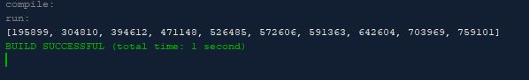

# RadixSort

The assignment wants to to create a program that randomly generates 1 million integers then sorts then
using the method of radix sort. Radix sort is basically the same thing as a normal bucket sort, but instead
uses only 10 buckets and divides the keys into subgroups based on their radix positions. It applies a bucket sort repeatedly for the key values on radix positions, starting from the least-significant position.

## Example Output

This image will display as your example output. Name the image README.jpg in your project folder.



## Analysis Steps

The assignment wants to to create a program that randomly generates 1 million integers then sorts then
using the method of radix sort. I analzyed the requirements by simply looking at what was given to me 
and looking up what radix sort is in the pearson chapter to know what i'm supposed to be doing.

### Design

I used only one class and the radix-sort method so that I may sort them as a radix-sort, also the main method
has the print statement and calls the sorting.

```
  int maxOrder = 1000000;
  int[] list = new int[10]; 
  for (int i = 0; i < list.length; i++) {
   list[i] = (int) (Math.random() * maxOrder);
  }
  
  radixSort(list);
  System.out.println(Arrays.toString(list));
```

### Testing

A step by step series of examples that you developed to properly test the program. 

Say what the step will be

```
Give the example
```

And repeat

```
until finished
```

End with an example of getting some data out of the system or using it for a little demo

## Notes

No Notes or Issues

## Do not change content below this line
## Adapted from a README Built With

* [Dropwizard](http://www.dropwizard.io/1.0.2/docs/) - The web framework used
* [Maven](https://maven.apache.org/) - Dependency Management
* [ROME](https://rometools.github.io/rome/) - Used to generate RSS Feeds

## Contributing

Please read [CONTRIBUTING.md](https://gist.github.com/PurpleBooth/b24679402957c63ec426) for details on our code of conduct, and the process for submitting pull requests to us.

## Versioning

We use [SemVer](http://semver.org/) for versioning. For the versions available, see the [tags on this repository](https://github.com/your/project/tags). 

## Authors

* **Billie Thompson** - *Initial work* - [PurpleBooth](https://github.com/PurpleBooth)

See also the list of [contributors](https://github.com/your/project/contributors) who participated in this project.

## License

This project is licensed under the MIT License - see the [LICENSE.md](LICENSE.md) file for details

## Acknowledgments

* Hat tip to anyone who's code was used
* Inspiration
* etc
